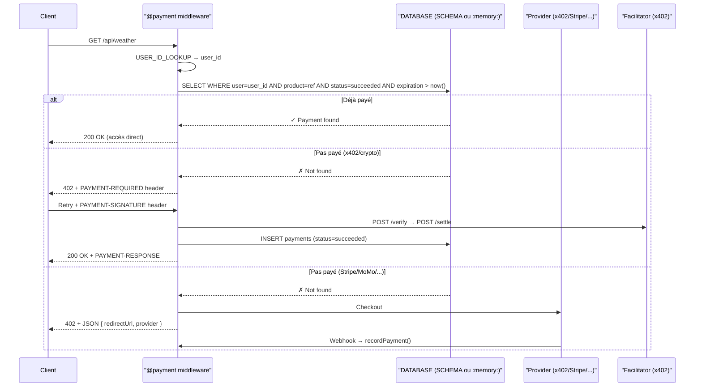

# PAYMENT — Module de Paiement

Le module `PAYMENT` intègre un système de paiement complet avec support natif de **Stripe**, **Mobile Money** (MTN, Orange, Airtel), **x402/crypto** (paiement blockchain via facilitateur), et de **providers custom** entièrement configurables via le DSL Binder.

## Architecture Unifiée



## Principe

Le module est déclaré dans un bloc `PAYMENT ... END PAYMENT` et monté sur un serveur HTTP via la directive `PAYMENT name /prefix` dans un bloc `HTTP`, ou automatiquement via le middleware `@payment`.

```bind
PAYMENT 'stripe://sk_live_xxx' [default]
    NAME stripe
    MODE sandbox
    CURRENCY EUR
    CALLBACK "https://myapp.com/api/payment/webhook"
    REDIRECT success "/merci"
    REDIRECT cancel  "/annule"
    REDIRECT failure "/echec"
END PAYMENT

HTTP :8080
    PAYMENT stripe /pay
END HTTP
```

---

## Directives

### NAME *(obligatoire)*
Identifiant de l'instance. Utilisé dans `PAYMENT name /prefix` et `require('payment')`.

### MODE
```bind
MODE sandbox       // ou production
```
Définit le mode d'exécution (sandbox/test vs production).

### CURRENCY / COUNTRY
```bind
CURRENCY XOF       // devise par défaut
COUNTRY CM         // code ISO pays (pour MoMo)
```

### CALLBACK
URL asynchrone de confirmation (webhook).

### REDIRECT
URLs de redirection après un checkout :
```bind
REDIRECT success "/merci"
REDIRECT cancel  "/annule"
REDIRECT failure "/echec"
```

### TTL
Durée de validité par défaut pour les paiements :
```bind
TTL 30d            // 30 jours
TTL 5mn            // 5 minutes
TTL 1h             // 1 heure
TTL lifetime       // permanent (aliases: once, life, forever → +999 ans)
```

### SCHEMA
Lien vers une table DATABASE pour le suivi des paiements :
```bind
SCHEMA 'paiements:payments(ref,amount,currency,provider,status,product,user,expiration)'
```
Format : `'nom_db:nom_table(champ1,champ2,...champ8)'`

> Si `SCHEMA` n'est pas déclaré, une base `sqlite://:memory:` est créée automatiquement avec un schéma prédéfini. Les données sont perdues au redémarrage.

### USER_ID_LOOKUP
Script JS (inline ou fichier) pour extraire l'identifiant utilisateur de la requête :
```bind
USER_ID_LOOKUP BEGIN
    const token = req.headers['authorization']?.split(' ')[1]
    return jwt.verify(token).sub
END USER_ID_LOOKUP
```
Contexte disponible : `req.headers`, `req.ip`, `req.cookies`, `req.method`, `req.path`.

> Si `USER_ID_LOOKUP` n'est pas déclaré, un hash `SHA-256(IP + User-Agent)` est utilisé par défaut (identification anonyme par client).

---

## Providers Natifs

### Stripe
Connexion via URI `stripe://sk_xxx`.
Supporte : `charge`, `verify`, `refund`, `checkout`.

### Mobile Money (MTN / Orange / Airtel)
Connexion via URI `mtn://...`, `orange://...`, `airtel://...`.
Supporte : `charge` (push payment), `verify`.

### Flutterwave / CinetPay
Connexion via URI `flutterwave://...`, `cinetpay://...`.
Supporte : `charge`, `verify`, `checkout`, `refund` (Flutterwave).

### x402 / Crypto
Connexion via URI `x402://facilitator_url` ou `crypto://facilitator_url`.
Supporte le standard [x402](https://www.x402.org/) pour les micropaiements blockchain.

```bind
PAYMENT 'crypto://x402.org/facilitator'
    NAME super_crypto
    MODE sandbox

    # Wallets de réception par chaîne
    WALLET evm  "0xYourEvmAddress"
    WALLET svm  "YourSolanaAddress"

    # Réseaux (identifiants CAIP-2)
    NETWORK evm  "eip155:84532"
    NETWORK svm  "solana:EtWTRABZaYq6iMfeYKouRu166VU2xqa1"

    # Schéma de paiement
    SCHEME exact               # exact | upto
    USE https                  # https | http

    # Liaison DB
    SCHEMA 'paiements:payments(ref,amount,currency,provider,status,product,user,expiration)'
    USER_ID_LOOKUP BEGIN
        const token = req.headers['authorization']?.split(' ')[1]
        return jwt.verify(token).sub
    END USER_ID_LOOKUP
    TTL 30d
END PAYMENT
```

#### Sous-directives x402

| Directive | Description |
|---|---|
| `WALLET chain address` | Adresse de réception (`evm`, `svm`) |
| `NETWORK chain id` | Identifiant réseau CAIP-2 |
| `SCHEME exact\|upto` | `exact` = montant fixe, `upto` = montant max autorisé |
| `USE https\|http` | Protocole pour le facilitateur |

#### Flux x402

1. Client → `GET /api/data` → **402** + header `X-PAYMENT-REQUIRED` (JSON Base64)
2. Client signe et envoie → `GET /api/data` + header `X-PAYMENT` (signature Base64)
3. Server → POST facilitateur `/verify` → `/settle` → **200** + header `X-PAYMENT-RESPONSE`

---


## Provider Custom

Pour les fournisseurs non supportés nativement, le DSL permet de définir chaque opération :

```bind
PAYMENT 'custom'
    NAME mypay
    CURRENCY XOF

    CHARGE DEFINE
        ENDPOINT "https://api.mypay.com/v1/charges"
        METHOD POST
        HEADER Authorization "Bearer key"
        BODY BEGIN
            append("amount",    payment.amount)
            append("currency",  payment.currency)
            append("reference", payment.orderId)
        END BODY
        RESPONSE BEGIN
            if (response.status !== 200) reject(response.body.message)
            resolve({ id: response.body.transactionId, status: "pending" })
        END RESPONSE
    END CHARGE

    VERIFY DEFINE
        ENDPOINT "https://api.mypay.com/v1/charges/{id}"
        METHOD GET
        HEADER Authorization "Bearer key"
        RESPONSE BEGIN
            resolve({ id: response.body.id, status: response.body.state })
        END RESPONSE
    END VERIFY

    REFUND DEFINE
        ENDPOINT "https://api.mypay.com/v1/refunds"
        METHOD POST
        BODY BEGIN
            append("transactionId", payment.id)
            append("amount",        payment.amount)
        END BODY
        RESPONSE BEGIN
            resolve({ id: response.body.refundId, status: "refunded" })
        END RESPONSE
    END REFUND

    CHECKOUT DEFINE
        ENDPOINT "https://api.mypay.com/v1/checkout"
        METHOD POST
        BODY BEGIN
            append("success_url", payment.redirects.success)
            append("cancel_url",  payment.redirects.cancel)
            append("amount",      payment.amount)
        END BODY
        RESPONSE BEGIN
            resolve({ redirectUrl: response.body.checkoutUrl, id: response.body.sessionId })
        END RESPONSE
    END CHECKOUT

    PUSH DEFINE
        ENDPOINT "https://api.mypay.com/v1/push"
        METHOD POST
        BODY BEGIN
            append("phone",  payment.phone)
            append("amount", payment.amount)
        END BODY
        RESPONSE BEGIN
            if (response.status !== 202) reject("Push failed")
            resolve({ id: response.body.requestId, status: "pending" })
        END RESPONSE
    END PUSH
END PAYMENT
```

> **Note** : `USSD DEFINE...END USSD` est accepté comme alias de `PUSH DEFINE...END PUSH` pour la rétro-compatibilité.

### Sous-directives Custom

| Directive | Description |
|---|---|
| `ENDPOINT` | URL de l'API (`{id}` interpolé automatiquement) |
| `METHOD` | Méthode HTTP (GET, POST, etc.) |
| `HEADER key value` | En-tête statique (ou script JS inline/fichier) |
| `BODY BEGIN...END BODY` | Corps de la requête (script JS, appel `append(k,v)`) |
| `QUERY key value` | Paramètre de query string |
| `RESPONSE BEGIN...END RESPONSE` | Script de traitement de la réponse (`resolve()` / `reject()`) |

---

## Middleware `@payment`

Gate d'accès payant pour les routes HTTP. Vérifie d'abord en DB, puis déclenche le flux de paiement approprié.

```bind
HTTP :8080
    # x402 — micropaiement crypto
    GET @payment[name="super_crypto" price="$0.001" desc="Weather data" ref=product_1 ttl=1d] /api/weather BEGIN
        res.json({ weather: "sunny" })
    END

    # Stripe — page de checkout
    GET @payment[name="stripe" price="500" desc="Premium" ref=premium_access] /api/premium BEGIN
        res.json({ content: "Premium data..." })
    END

    # Protection de groupe
    GROUP @payment[name="super_crypto" price="$0.005" ref=product_3] /api/premium DEFINE
        GET /data BEGIN ... END
        POST /process BEGIN ... END
    END GROUP
END HTTP
```

### Arguments du middleware

| Argument | Description |
|---|---|
| `name` | Nom de la connexion PAYMENT |
| `price` | Prix (`"$0.001"` pour x402, `"500"` en centimes pour Stripe) |
| `desc` | Description du produit |
| `ref` | Référence produit (clé de lookup en DB) |
| `scheme` | Override du scheme (`exact` / `upto`) |
| `ttl` | Override du TTL (`1d`, `lifetime`, etc.) |

### Auto-mount des webhooks

Si `@payment[name="X"]` est utilisé mais sans `PAYMENT X /prefix` dans le bloc HTTP, les webhooks sont montés automatiquement sur `/_pay/hook/X`.

---

## Webhooks

```bind
WEBHOOK @PRE /pay/webhook BEGIN [secret=xxx]
    if (!verify(request.body, request.headers["stripe-signature"], args.secret))
        reject("bad signature")
END WEBHOOK

WEBHOOK @POST /pay/webhook BEGIN
    if (payment.status === "succeeded") { /* traitement */ }
END WEBHOOK
```

| Phase | Description |
|---|---|
| `@PRE` | Validation avant traitement (signature, intégrité) |
| `@POST` | Logique métier après validation |

---

## API JavaScript — `require('payment')`

```js
const pay = require('payment')           // connexion par défaut
const sg  = pay.get('stripe')            // alias pour connection()
const crypto = pay.get('super_crypto')

// ── Opérations standard ──────────────────────────────
const result = pay.charge({
    amount: 5000, currency: "XOF",
    phone: "237612345678", email: "u@e.com",
    orderId: "ORD-001",
})
const status = pay.verify("txn_abc123")
pay.refund({ id: "txn_abc123", amount: 2500 })
const checkout = pay.checkout({ amount: 5000, orderId: "ORD-002" })

// Push payment (ex-USSD) — push message, USSD, email, SMS
const push = pay.push({ phone: "237612345678", amount: 1000, orderId: "ORD-003" })
// Backward compat : pay.ussd() est un alias de pay.push()

// ── x402/crypto accessors ────────────────────────────
crypto.isX402           // → true
crypto.facilitator      // → "https://x402.org/facilitator"
crypto.wallets          // → { evm: "0x...", svm: "..." }
crypto.networks         // → { evm: "eip155:84532", svm: "..." }
crypto.scheme           // → "exact"

// ── DB-backed helpers (tous providers) ───────────────
crypto.isPaid(userID, ref)                                   // → bool
crypto.getPayments(userID, ref, include_expired=false)       // → payment []record ou un tableau vide
crypto.getAmountPayments(userID, ref)                        // → number (somme des montants des transactions payées et non expirées)
crypto.totalPayments(userID, ref)                            // → number (nombre de transactions payées et non expirées)
crypto.infoPayments({userID: undefined, ref: undefined, include_expired: false, limit: 10, offset: 0, start: undefined, end: undefined})
// → {
//      total: number,        // nombre de paiements (actifs)
//      amount: number,       // somme des montants (actifs)
//      transactions: [],     // transactions actives
//      expired: []           // transactions expirées (vide si include_expired=false)
//   } (si ref est undefined, renvoie toutes les transactions de l'utilisateur. Si userID n'est pas défini, renvoie les transactions de tous les utilisateurs)

// ── Gestion des connexions ───────────────────────────
pay.connection("stripe")
pay.connectionNames      // accessor
pay.hasConnection("mtn") // bool
pay.hasDefault           // accessor bool
pay.default              // accessor → proxy connexion par défaut

pay.connect("stripe://sk_test_xxx", "stripe2", { currency: "EUR" })
```

### Contexte `payment` dans les handlers protégés

Dans les handlers de routes protégées par `@payment`, un objet `payment` est disponible :

```js
payment.userID     // string — user ID résolu
payment.ref        // string — référence produit
payment.provider   // string — "x402" | "stripe" | ...
payment.status     // string — "new" | "succeeded"
payment.settle(n)  // function — pour scheme upto (x402)
```

---

## Routes HTTP générées

Lorsque monté via `PAYMENT name /prefix` ou auto-monté sur `/_pay/hook/name` :

| Méthode | Chemin | Description |
|---|---|---|
| `POST` | `/prefix/charge` | Initier un paiement |
| `GET` | `/prefix/verify/:id` | Vérifier le statut |
| `POST` | `/prefix/refund` | Rembourser |
| `POST` | `/prefix/checkout` | Créer une session checkout |
| `POST` | `/prefix/push` | Push payment (ex-USSD) |
| `POST` | `/prefix/webhook` | Webhook de confirmation |
| `GET` | `/prefix/transaction` | Historique (`?start=,end=,limit=10,offset=0,page=1,ref=,include_expired=`) |

---

## Réseaux CAIP-2 supportés (x402)

| Chaîne | Réseau | CAIP-2 ID |
|---|---|---|
| `evm` | Base Sepolia (testnet) | `eip155:84532` |
| `evm` | Base Mainnet | `eip155:8453` |
| `evm` | Ethereum Mainnet | `eip155:1` |
| `svm` | Solana Mainnet | `solana:5eykt4UsFv8P8NJdTREpY1vzqKqZKvdp` |
| `svm` | Solana Devnet | `solana:EtWTRABZaYq6iMfeYKouRu166VU2xqa1` |
